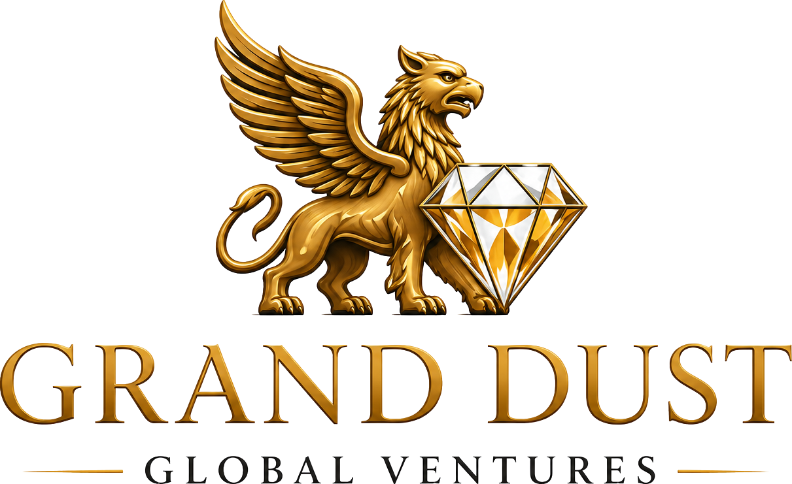

<div align="center">
  
  
  # Grand Dust Global Ventures

  **The World's Most Elite Financial Advisory**  
  *Building Wealth. Preserving Legacies.*

  [](https://nextjs.org/)
  [](https://www.typescriptlang.org/)
  [](https://nextjs.org/docs/architecture/turbopack)
  [](#bilingual-experience)

</div>

---

## 🏛️ Executive Summary

**Grand Dust Global Ventures** is an ultra-premium, private wealth advisory firm providing structured property-backed financing, real estate transactions, gold & silver operations, and diamond trade across **India (Coimbatore & Mumbai), Malaysia (Kuala Lumpur), and the USA**.

This repository contains the bespoke Next.js 16 web application built with a private-wealth aesthetic, single-viewport hero fold, vector SVG icons, full bilingual support (English & Tamil), and modern Search & Answer Engine Optimization (SEO / AEO).

---

## ✨ Key Features & Design Philosophy

- **Private Wealth Aesthetic**: Refined palette (`#FAF8F4` Warm Cream background, `#232323` Charcoal, `#C89B3C` Gold, `#5D2D34` Burgundy) with Cormorant Garamond headings and Inter body typography.
- **Single-Fold Hero (100vh)**: Clean desktop hero viewport featuring editorial architecture backdrop, tagline, headline, primary/secondary action buttons, and global presence indicators.
- **Dedicated Core Capabilities Section**: Clean overview banner immediately following the hero displaying bilingual service summaries.
- **100% Vector SVG Iconography**: Zero cheap emojis. Custom vector stroke icons for all features, trust badges, process steps, stats, and footer items.
- **Bilingual Content (English & Tamil)**: Seamless side-by-side English and Tamil translations integrated across all pages and sections.
- **Mobile Responsive**: Custom breakpoint optimization ensuring crisp high-res logo scaling, clean mobile background rendering, and flexible navigation drawers.
- **SEO & AEO Ready**: JSON-LD structured data (Organization, WebSite, LocalBusiness, FAQPage), dynamic `sitemap.xml`, `robots.txt`, and AI-crawler discoverability files (`llms.txt` & `llms-full.txt`).

---

## 🛠️ Technology Stack

- **Framework**: Next.js 16.3.0-canary (App Router, Turbopack)
- **Language**: TypeScript
- **Styling**: Custom Vanilla CSS with CSS Custom Properties (`globals.css`)
- **Fonts**: `Cormorant_Garamond` (headings), `Inter` (body), `Noto_Sans_Tamil` (Tamil script) via `next/font`
- **Asset Optimization**: `next/image` with WebP/AVIF output, trimmed high-res branding assets

---

## 📁 Project Structure

```
d:\grand dust\
├── public/
│   ├── images/
│   │   ├── logo.png              ← Trimmed high-res brand emblem
│   │   ├── hero-editorial.png    ← Editorial architecture backdrop
│   │   ├── service-finance.png   ← Property-backed finance imagery
│   │   ├── service-realestate.png← Luxury real estate imagery
│   │   ├── service-gold.png      ← Gold & silver operations imagery
│   │   ├── service-diamond.png   ← Certified diamond trade imagery
│   │   └── city-*.png            ← Office location skyline assets
│   ├── llms.txt                  ← AEO index for AI answer engines
│   └── llms-full.txt             ← Full text export for AI crawlers
├── src/
│   ├── app/
│   │   ├── layout.tsx            ← Root layout (fonts, metadata, JSON-LD)
│   │   ├── globals.css           ← Comprehensive design system v2
│   │   ├── page.tsx              ← Home page (Hero, Overview, Trust, Services, Stats, Process, About, Locations, Testimonials, CTA)
│   │   ├── about/page.tsx        ← Company story, founder, values
│   │   ├── services/
│   │   │   ├── page.tsx          ← Services overview
│   │   │   └── [slug]/page.tsx   ← Dynamic service detail & FAQ pages
│   │   ├── locations/page.tsx    ← Global presence details
│   │   ├── contact/page.tsx      ← Contact form & office details
│   │   ├── sitemap.ts            ← Dynamic XML sitemap generator
│   │   └── robots.ts             ← Crawl rules
│   ├── components/
│   │   ├── Navbar.tsx            ← 88px glassmorphic fixed header
│   │   ├── Footer.tsx            ← Multi-column footer with vector SVG icons
│   │   ├── Icons.tsx             ← Centralized vector SVG stroke components
│   │   ├── ScrollReveal.tsx      ← Intersection Observer animation wrapper
│   │   └── WhatsAppFloat.tsx     ← Floating contact widget
│   └── lib/
│       └── content.ts            ← Centralized bilingual content dictionary
├── next.config.ts
├── package.json
└── tsconfig.json
```

---

## 💼 Business Verticals

1. **Finance & Mortgage Loans**
   - Loan Against Property up to 50% of market value
   - Residential & Commercial property mortgage
   - Attractive interest rates & fast approval
2. **Real Estate Transactions**
   - Land buying & selling
   - Legally verified properties & end-to-end transaction support
3. **Gold & Silver Operations**
   - Custom made-to-order jewelry manufacturing
   - Gold pledge arrangements & redemption services at best rates
4. **Diamond Trade**
   - Direct buying and selling of certified genuine diamonds

---

## 🚀 Getting Started

### Prerequisites

- Node.js 18+ installed on your machine.

### Installation & Running Locally

```bash
# Clone or navigate to directory
cd "d:\grand dust"

# Install dependencies (if needed)
npm install

# Start the local development server
npm run dev
```

Open [http://localhost:3000](http://localhost:3000) in your browser to view the live application.

### Building for Production

```bash
# Generate optimized production build
npm run build

# Start the production server
npm run start
```

---

## 🌐 Global Operating Presence

| Location | Country | Role |
|---|---|---|
| **Coimbatore** | 🇮🇳 India | Headquarters & Primary Operations |
| **Mumbai** | 🇮🇳 India | Financial Capital Operations |
| **Kuala Lumpur** | 🇲🇾 Malaysia | Southeast Asia Advisory |
| **USA** | 🇺🇸 United States | International Investor Relations |

---

## 📞 Executive Contact

- **Founder & Chairman**: Guruprasad
- **Phone**: +91 9043425551
- **Email**: [guru25551@gmail.com](mailto:guru25551@gmail.com)
- **WhatsApp**: [+91 9043425551](https://wa.me/919043425551)

---

<div align="center">
  <p>© 2026 Grand Dust Global Ventures. All Rights Reserved.</p>
</div>
